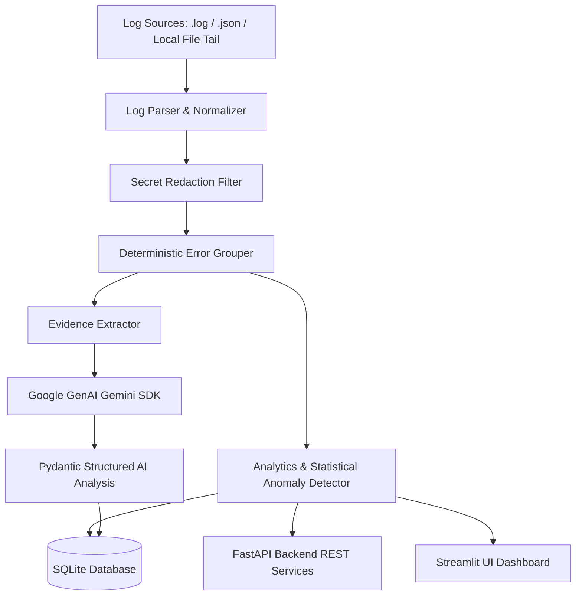

# LogMind AI — Architecture Documentation

## 1. Executive Overview

LogMind AI is a hybrid log-analysis platform combining a deterministic Python processing engine with evidence-grounded GenAI incident explanations.

## 2. Core Subsystems

### A. Parser & Normalizer (`logmind/parser.py`, `logmind/normalizer.py`)
- Supports plain-text application logs and JSON formatted logs.
- Multiline exception and stack trace buffering.
- Variable pattern substitution (UUIDs, IP addresses, memory addresses, timestamps) for stable fingerprinting.

### B. Error Grouping & Analytics (`logmind/error_grouper.py`, `logmind/analytics.py`)
- Fingerprint generation via MD5 hash of `(service + severity + normalized_template)`.
- Prevents unrelated errors from merging based solely on severity.
- Computes time-series distributions and frequency counts.

### C. Statistical Anomaly Detector (`logmind/anomaly_detector.py`)
- Z-score rolling window error count spike detection.
- High-frequency error group dominance tracking (>25% total volume).
- Minimum event thresholds to prevent false positives on small sample sizes.

### D. Real-Time Local Log Monitor (`logmind/monitoring_service.py`, `logmind/log_collector.py`)
- Background thread tailer using byte offset tracking.
- Partial line buffering and automatic truncation detection.
- Thread-safe state management (`threading.Event`).

### E. GenAI Incident Analyzer (`logmind/ai_analyzer.py`)
- Official `google-genai` SDK wrapper.
- Structured response enforcement via Pydantic (`AIAnalysisReport`).
- Prompt injection defense using `<log_evidence>` untrusted text boundaries.
- Graceful offline fallback when Gemini API key is unconfigured.
